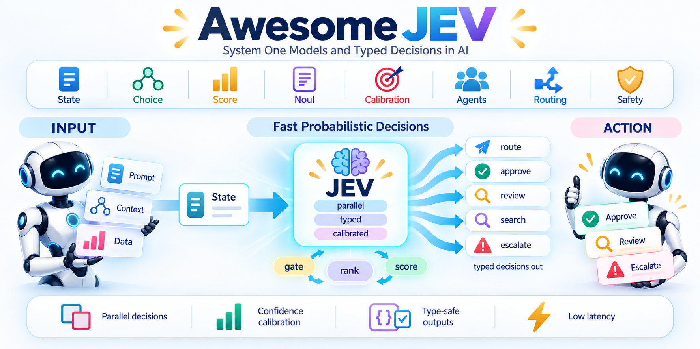

<div align="center">



# Awesome JEV [](https://awesome.re)

> Papers, open models and evaluations behind System One models, the class of AI that answers typed questions with calibrated probabilities in one pass.

[](https://omnijev.github.io/awesome-jev/)


[](LICENSE)
[](#contributing)

⚡ Jev · 🎯 Decide · 📏 Trust · ⏩ Fast · 📊 Measure

</div>

---

## Contents

- [✅ What Gets In](#-what-gets-in)
- [🔥 News](#-news)
- [⚡ System One & Jev](#-system-one--jev) (18)
- [🔓 Open Reproductions](#-open-reproductions) (17)
- [🧠 Dual-Process Theory, Fast and Slow AI](#-dual-process-theory-fast-and-slow-ai) (12)
- [🎯 Zero-Shot & Prompted Classifiers](#-zero-shot--prompted-classifiers) (13)
- [⚖️ Judges, Verifiers & Reward Models](#-judges-verifiers--reward-models) (10)
- [🔀 Routing, Cascades & Selection](#-routing-cascades--selection) (11)
- [🛡️ Guardrails & Safety Classifiers](#-guardrails--safety-classifiers) (13)
- [📏 Calibration & Uncertainty](#-calibration--uncertainty) (16)
- [🧱 Typed & Constrained Outputs](#-typed--constrained-outputs) (14)
- [⏩ Non-Autoregressive & Parallel Inference](#-non-autoregressive--parallel-inference) (9)
- [📊 Benchmarks & Independent Evaluations](#-benchmarks--independent-evaluations) (21)
- [📰 Commentary & Analysis](#-commentary--analysis) (7)
- [🔗 Related Lists](#-related-lists) (13)

---

## ✅ What Gets In

Jev shipped on 15 September 2026 and little has been written about it, so this list stays small. An entry has to pass one of three tests.

- **Primary.** By TypeSafe, or a direct reproduction or evaluation of Jev.
- **Named.** Named by TypeSafe's own materials, or by the launch discussion, as what Jev is or what Jev replaces.
- **Same shape.** The answer set is fixed before inference, the model returns a probability per option, and no free text is generated.

Anything else, however good, is left to the related lists at the end.

---

## 🔥 News

🚀 **2026-09 · Repository launch.** 161 entries in 12 sections. PRs welcome.

🔓 **2026-09 · Open reproductions and evaluations.** 17 open models and codebases rebuild the System One shape, and 16 independent evaluations of Jev are collected under Benchmarks & Independent Evaluations.

---

## ⚡ System One & Jev

What TypeSafe has published: the launch post, the docs, the SDKs, and the failure modes it admits to.

- ⭐ [Introducing System One Models and Jev](https://typesafe.ai/blog/introducing-system-one-models-and-jev), The launch post: state in, typed probabilistic decisions out, RLCD training, 70 to 500 ms, $0.042 per MTok. [](https://typesafe.ai/blog/introducing-system-one-models-and-jev)
- ⭐ [Primitives: Choice, Score, Noul](https://docs.typesafe.ai/primitives), The three typed question shapes and the probability-per-option answers they return. [](https://docs.typesafe.ai/primitives)
- ⭐ [Jev 1.13 jaggedness](https://docs.typesafe.ai/model-jaggedness/jev-1.13), TypeSafe's documented failure modes: literal reading, counting, dates, indirection, distractor state, adversarial content. [](https://docs.typesafe.ai/model-jaggedness/jev-1.13)
- ⭐ [System One Adapter](https://github.com/typesafe-ai/system-one-adapter-python), Official drop-in that serves the same typed interface from OpenAI or Anthropic models, the baseline for every comparison. [](https://github.com/typesafe-ai/system-one-adapter-python)
- ⭐ [Hacker News launch thread](https://news.ycombinator.com/item?id=49717558), 1,850 points and 485 comments; the CEO confirms the zero-shot classifier reading and the encoder-with-heads shape. [](https://news.ycombinator.com/item?id=49717558)
- [System One (concept)](https://docs.typesafe.ai/concepts/system-one), Defines the model class: fast structured decisions for software, contrasted with text-generating LLMs. [](https://docs.typesafe.ai/concepts/system-one)
- [Confidence](https://docs.typesafe.ai/confidence), Confidence as a statistic of the returned distribution, and the act, confirm or escalate thresholds built on it. [](https://docs.typesafe.ai/confidence)
- [AI primer: why calibrated decisions](https://docs.typesafe.ai/introduction/machine-learning-primer), TypeSafe's own account of RLCD as a third post-training regime beside RLHF and RLVR. [](https://docs.typesafe.ai/introduction/machine-learning-primer)
- [Patterns](https://docs.typesafe.ai/patterns), Speculative fan-out, confidence-gated routing, composite scoring and intent routing as architectural patterns. [](https://docs.typesafe.ai/patterns)
- [HTTP API reference](https://docs.typesafe.ai/api), The request and response contract for POST /v1/systemone. [](https://docs.typesafe.ai/api)
- [Cookbooks](https://docs.typesafe.ai/cookbooks/parallel_questions), Reproducible recipes for parallel questions, reranking, guardrails, extraction and hierarchical classification. [](https://docs.typesafe.ai/cookbooks/parallel_questions)
- [TypeSafe Python SDK](https://github.com/typesafe-ai/typesafe-sdk-python), Official synchronous and asynchronous Python client. [](https://github.com/typesafe-ai/typesafe-sdk-python) [](https://docs.typesafe.ai/sdk/python)
- [TypeSafe JavaScript SDK](https://github.com/typesafe-ai/typesafe-sdk-js), Official TypeScript client with answer types inferred from the questions. [](https://github.com/typesafe-ai/typesafe-sdk-js)
- [TypeSafe Agent Skills](https://github.com/typesafe-ai/skills), Skill files that teach Claude Code, Codex and similar agents to design System One workflows. [](https://github.com/typesafe-ai/skills) [](https://docs.typesafe.ai/agent-skill)
- [Jev on Vercel AI SDK](https://ai-sdk.dev/providers/ai-sdk-providers/typesafe-ai), The first third-party surface: Jev-latest as an evaluation model behind experimental_evaluate, no waitlist. [](https://ai-sdk.dev/providers/ai-sdk-providers/typesafe-ai)
- [Manifesto](https://typesafe.ai/manifesto), Machine-native composable AI as reliable primitives for programmers, against the assistant framing. [](https://typesafe.ai/manifesto)
- [Lies, Damned Lies, and Benchmarks](https://typesafe.ai/blog/antibenchmaxxing), Why TypeSafe publishes dated, retired eval snapshots instead of a benchmark table. [](https://typesafe.ai/blog/antibenchmaxxing)
- [Founder launch thread on X](https://x.com/CompleteSkeptic/status/2099925682726002904), Diogo Almeida's thread arguing RLCD decision models reach economic value before chat models do. [](https://x.com/CompleteSkeptic/status/2099925682726002904)

---

## 🔓 Open Reproductions

Open weights and code that rebuild the System One shape from encoders, small decoders and constrained decoding.

- ⭐ [OpenJev](https://github.com/TheoLeeCJ/openjev), Can something like Jev run on a 3090 at home; open baseline for direct typed option scoring. [](https://github.com/TheoLeeCJ/openjev) [](https://openjev.com)
- ⭐ [Jevlike](https://github.com/vinnylarouge/jevlike), From-scratch model with Jev's exact shape: text plus N options in, one probability per option out, option-attention head, Doom and chess demos. [](https://github.com/vinnylarouge/jevlike)
- ⭐ [Qwen-2.5-1B-RLCD](https://huggingface.co/harshatheg/Qwen-2.5-1B-RLCD), Qwen2.5-1.5B fine-tune plus parallel constrained decoding; all schema fields scored in one broadcast prefill, 5.6x to 7x faster on Apple Silicon. [](https://huggingface.co/harshatheg/Qwen-2.5-1B-RLCD)
- [dspy-typesafeify](https://github.com/typesafeainate/dspy-typesafeify), Decorator that routes DSPy typed Signatures to Jev where the signature is a pure decision. [](https://github.com/typesafeainate/dspy-typesafeify)
- [typesafe-ai-benchmark (imposter Jev)](https://github.com/iammrduncan/typesafe-ai-benchmark), LLM gateway that mimics the TypeSafe structured-output contract, used for Qwen-on-Cerebras side-by-sides. [](https://github.com/iammrduncan/typesafe-ai-benchmark)
- [openjev-sglang](https://github.com/ekzhang/openjev-sglang), Jev-compatible API endpoint served from open models with prefill-only inference. [](https://github.com/ekzhang/openjev-sglang)
- [Jev on a laptop](https://github.com/rorshopping/jev-on-a-laptop), Unofficial study of Jev-style parallel typed decisions on stock 1.5B to 8B models on Apple Silicon, with benchmarks. [](https://github.com/rorshopping/jev-on-a-laptop) [](https://huggingface.co/spaces/rorshopping/parallel-constrained-decisions)
- [jevbetter](https://github.com/olanotolu/jevbetter), One-pass scorer over a variable option list: hashed n-gram encoder, rival-aware attention, gated head, temperature scaling. [](https://github.com/olanotolu/jevbetter)
- [decider](https://github.com/Mapika/decider), Qwen3.5-2B fine-tune that emits typed decisions with calibrated probabilities in one pass. [](https://github.com/Mapika/decider)
- [openjev (zhihz)](https://github.com/zhihz/openjev), Local bilingual probability decisions from context, questions and candidate answers. [](https://github.com/zhihz/openjev)
- [rlcd-modernbert-151m](https://github.com/Heman10x-NGU/Verdict-open-jev), Encoder-side reproduction: GLiClass ModernBERT base retrained for calibrated label probabilities. [](https://github.com/Heman10x-NGU/Verdict-open-jev) [](https://huggingface.co/heman10x/rlcd-modernbert-151m)
- [qwen-rlcd](https://github.com/shamazharikh/qwen-rlcd), Choice, Score and Noul on Qwen3.5-0.8B, the smallest decoder-based reproduction. [](https://github.com/shamazharikh/qwen-rlcd)
- [Parallel Constrained Decision Engine](https://huggingface.co/spaces/drinkmoonshine/parallel-constrained-decoding), Live demo of the Qwen-2.5-1B-RLCD approach: KV-cache broadcast, logit slicing per candidate, 100 percent schema validity. [](https://huggingface.co/spaces/drinkmoonshine/parallel-constrained-decoding)
- [LFM2.5-2.6B-RLCD](https://huggingface.co/monotykamary/LFM2.5-2.6B-RLCD), RLCD-style fine-tune of Liquid AI's LFM2.5-2.6B, the largest open attempt so far. [](https://huggingface.co/monotykamary/LFM2.5-2.6B-RLCD)
- [LFM2.5-350M-RLCD](https://huggingface.co/notnotsamuel/LFM2.5-350M-RLCD), 350M-parameter RLCD-style decision model, the smallest open attempt. [](https://huggingface.co/notnotsamuel/LFM2.5-350M-RLCD)
- [system-one-qwen3.5-4b-scorer](https://huggingface.co/pngwn/system-one-qwen3.5-4b-scorer), Qwen3.5-4B base trained as a Score-style rubric rater. [](https://huggingface.co/pngwn/system-one-qwen3.5-4b-scorer)
- [system-one-mini](https://huggingface.co/DavidHatley/system-one-mini), DistilBERT-sized System One shape, a floor for how small the idea can go. [](https://huggingface.co/DavidHatley/system-one-mini)

---

## 🧠 Dual-Process Theory, Fast and Slow AI

The psychology the name comes from, and the AI systems that pair a fast intuitive decider with a slow reasoner.

- ⭐ [Thinking, Fast and Slow](https://en.wikipedia.org/wiki/Thinking,_Fast_and_Slow), The source TypeSafe cites for naming Jev after System 1, fast intuitive judgement with no deliberation. [](https://en.wikipedia.org/wiki/Thinking,_Fast_and_Slow)
- ⭐ [Thinking Fast and Slow in AI](https://arxiv.org/abs/2010.06002).   [](https://huggingface.co/papers/2010.06002) [](https://ojs.aaai.org/index.php/AAAI/article/view/17765)
- ⭐ [Dualformer](https://arxiv.org/abs/2410.09918), "Controllable Fast and Slow Thinking by Learning with Randomized Reasoning Traces".   [](https://github.com/facebookresearch/dualformer) [](https://huggingface.co/papers/2410.09918)
- ⭐ [The Bitterest Lesson](https://typesafe.ai/blog/bitterest-lesson), TypeSafe's own essay ranking task choice above data, compute and algorithms, the argument behind System One Models. [](https://typesafe.ai/blog/bitterest-lesson)
- [Individual Differences in Reasoning (Stanovich & West)](https://doi.org/10.1017/S0140525X00003435), Coined the System 1 and System 2 labels TypeSafe took its System One product name from.  [](https://doi.org/10.1017/S0140525X00003435)
- [Maps of Bounded Rationality (Kahneman Nobel lecture)](https://www.nobelprize.org/prizes/economic-sciences/2002/kahneman/lecture/), Kahneman's two-system account, intuition returning an answer directly while reasoning deliberates, the split Jev's design copies. [](https://www.nobelprize.org/prizes/economic-sciences/2002/kahneman/lecture/)
- [SOFAI](https://arxiv.org/abs/2110.01834), "Thinking Fast and Slow in AI: the Role of Metacognition".  [](https://sites.google.com/view/sofai/home)
- [System-1.x](https://arxiv.org/abs/2407.14414), "Learning to Balance Fast and Slow Planning with Language Models".   [](https://github.com/swarnaHub/System-1.x)
- [GR00T N1](https://arxiv.org/abs/2503.14734), "An Open Foundation Model for Generalist Humanoid Robots".  [](https://github.com/NVIDIA/Isaac-GR00T) [](https://huggingface.co/papers/2503.14734) [](https://huggingface.co/nvidia/GR00T-N1-2B)
- [π0](https://arxiv.org/abs/2410.24164), "A Vision-Language-Action Flow Model for General Robot Control".   [](https://github.com/Physical-Intelligence/openpi) [](https://huggingface.co/papers/2410.24164) [](https://www.physicalintelligence.company/blog/pi0)
- [The Bitter Lesson](http://incompleteideas.net/IncIdeas/BitterLesson.html), The essay TypeSafe's own Bitterest Lesson argues against, named in TypeSafe's materials as its starting point. [](http://incompleteideas.net/IncIdeas/BitterLesson.html)
- [Jevons' paradox (Alcott 2005)](https://doi.org/10.1016/j.ecolecon.2005.03.020), The rebound effect Jev is named for, where cheaper decisions raise total decision volume.  [](https://doi.org/10.1016/j.ecolecon.2005.03.020)

---

## 🎯 Zero-Shot & Prompted Classifiers

Encoders, label-conditioned models and rerankers that map text to a label, a probability or a rank without writing prose. This is the model class Jev belongs to.

- ⭐ [BERT](https://arxiv.org/abs/1810.04805), "Pre-training of Deep Bidirectional Transformers for Language Understanding".  [](https://github.com/google-research/bert) [](https://huggingface.co/papers/1810.04805)
- ⭐ [Zero-shot Classification as Entailment](https://arxiv.org/abs/1909.00161), "Benchmarking Zero-shot Text Classification: Datasets, Evaluation and Entailment Approach".   [](https://github.com/yinwenpeng/BenchmarkingZeroShot) [](https://huggingface.co/papers/1909.00161)
- ⭐ [Universal NLI Classifiers (zeroshot-v2)](https://arxiv.org/abs/2312.17543), "Building Efficient Universal Classifiers with Natural Language Inference".  [](https://github.com/MoritzLaurer/zeroshot-classifier) [](https://huggingface.co/papers/2312.17543) [](https://huggingface.co/MoritzLaurer/deberta-v3-large-zeroshot-v2.0)
- ⭐ [GLiNER](https://arxiv.org/abs/2311.08526), "Generalist Model for Named Entity Recognition using Bidirectional Transformer".  [](https://github.com/urchade/GLiNER) [](https://huggingface.co/papers/2311.08526) [](https://huggingface.co/urchade/gliner_multi)
- ⭐ [monoBERT](https://arxiv.org/abs/1901.04085), "Passage Re-ranking with BERT".  [](https://github.com/nyu-dl/dl4marco-bert) [](https://huggingface.co/papers/1901.04085)
- [DeBERTaV3](https://arxiv.org/abs/2111.09543), "Improving DeBERTa using ELECTRA-Style Pre-Training with Gradient-Disentangled Embedding Sharing".  [](https://github.com/microsoft/DeBERTa) [](https://huggingface.co/papers/2111.09543) [](https://huggingface.co/microsoft/deberta-v3-base)
- [ModernBERT](https://arxiv.org/abs/2412.13663), "Smarter, Better, Faster, Longer: A Modern Bidirectional Encoder for Fast, Memory Efficient, and Long Context Finetuning and Inference".  [](https://github.com/AnswerDotAI/ModernBERT) [](https://huggingface.co/papers/2412.13663) [](https://huggingface.co/answerdotai/ModernBERT-base)
- [TARS](https://aclanthology.org/2020.coling-main.285/), Puts the label name in the input and returns a yes/no probability per candidate label, Jev's Noul shape from 2020.  [](https://github.com/flairNLP/flair)
- [SetFit](https://arxiv.org/abs/2209.11055), "Efficient Few-Shot Learning Without Prompts".  [](https://github.com/huggingface/setfit) [](https://huggingface.co/papers/2209.11055)
- [GLiClass](https://arxiv.org/abs/2508.07662), "Generalist Lightweight Model for Sequence Classification Tasks".  [](https://github.com/Knowledgator/GLiClass) [](https://huggingface.co/papers/2508.07662) [](https://huggingface.co/knowledgator/gliclass-modern-base-v3.0)
- [GLiNER2](https://arxiv.org/abs/2507.18546), "An Efficient Multi-Task Information Extraction System with Schema-Driven Interface".  [](https://github.com/fastino-ai/GLiNER2) [](https://huggingface.co/papers/2507.18546) [](https://huggingface.co/fastino/gliner2-base-v1)
- [Label Supervised LLaMA Finetuning](https://arxiv.org/abs/2310.01208).  [](https://github.com/4AI/LS-LLaMA) [](https://huggingface.co/papers/2310.01208)
- [Generative or Discriminative?](https://arxiv.org/abs/2506.12181), "Revisiting Text Classification in the Era of Transformers".  

---

## ⚖️ Judges, Verifiers & Reward Models

Models whose output is a verdict or a score. Jev's Score and Noul primitives are sold as a replacement for this layer.

- ⭐ [InstructGPT reward model](https://arxiv.org/abs/2203.02155), "Training language models to follow instructions with human feedback".  [](https://github.com/openai/following-instructions-human-feedback) [](https://huggingface.co/papers/2203.02155)
- ⭐ [MT-Bench](https://arxiv.org/abs/2306.05685), "Judging LLM-as-a-Judge with MT-Bench and Chatbot Arena".   [](https://github.com/lm-sys/FastChat) [](https://huggingface.co/papers/2306.05685)
- ⭐ [PRM800K](https://arxiv.org/abs/2305.20050), "Let's Verify Step by Step".   [](https://github.com/openai/prm800k) [](https://huggingface.co/papers/2305.20050)
- ⭐ [ArmoRM](https://arxiv.org/abs/2406.12845), "Interpretable Preferences via Multi-Objective Reward Modeling and Mixture-of-Experts".   [](https://github.com/RLHFlow/RLHF-Reward-Modeling) [](https://huggingface.co/papers/2406.12845) [](https://huggingface.co/RLHFlow/ArmoRM-Llama3-8B-v0.1)
- [Skywork-Reward](https://arxiv.org/abs/2410.18451), "Bag of Tricks for Reward Modeling in LLMs".  [](https://github.com/SkyworkAI/Skywork-Reward) [](https://huggingface.co/papers/2410.18451) [](https://huggingface.co/Skywork/Skywork-Reward-Gemma-2-27B-v0.2)
- [G-Eval](https://arxiv.org/abs/2303.16634), "NLG Evaluation using GPT-4 with Better Human Alignment".   [](https://github.com/nlpyang/geval) [](https://huggingface.co/papers/2303.16634)
- [Large Language Models are not Fair Evaluators](https://arxiv.org/abs/2305.17926).  [](https://github.com/i-Eval/FairEval) [](https://huggingface.co/papers/2305.17926)
- [LLM Evaluators Recognize and Favor Their Own Generations](https://arxiv.org/abs/2404.13076).  [](https://github.com/ArjunPanickssery/self_recognition) [](https://huggingface.co/papers/2404.13076)
- [MiniCheck](https://arxiv.org/abs/2404.10774), "Efficient Fact-Checking of LLMs on Grounding Documents".   [](https://github.com/Liyan06/MiniCheck) [](https://huggingface.co/papers/2404.10774) [](https://huggingface.co/lytang/MiniCheck-Flan-T5-Large)
- [Agent-as-a-Judge](https://arxiv.org/abs/2410.10934), "Evaluate Agents with Agents".   [](https://github.com/metauto-ai/agent-as-a-judge) [](https://huggingface.co/papers/2410.10934)

---

## 🔀 Routing, Cascades & Selection

Deciding which model, tool or path a request takes, with a cheap model in front of expensive ones. This is Jev's Choice primitive in production.

- ⭐ [FrugalGPT](https://arxiv.org/abs/2305.05176), "How to Use Large Language Models While Reducing Cost and Improving Performance".   [](https://github.com/stanford-futuredata/FrugalGPT) [](https://huggingface.co/papers/2305.05176)
- ⭐ [RouteLLM](https://arxiv.org/abs/2406.18665), "Learning to Route LLMs with Preference Data".  [](https://github.com/lm-sys/RouteLLM) [](https://huggingface.co/papers/2406.18665)
- ⭐ [Hybrid LLM](https://arxiv.org/abs/2404.14618), "Cost-Efficient and Quality-Aware Query Routing".   [](https://huggingface.co/papers/2404.14618)
- [RouterDC](https://arxiv.org/abs/2409.19886), "Query-Based Router by Dual Contrastive Learning for Assembling Large Language Models".   [](https://github.com/shuhao02/RouterDC) [](https://huggingface.co/papers/2409.19886)
- [Arch-Router](https://arxiv.org/abs/2506.16655), "Aligning LLM Routing with Human Preferences".  [](https://github.com/katanemo/plano) [](https://huggingface.co/papers/2506.16655) [](https://huggingface.co/katanemo/Arch-Router-1.5B)
- [Zooter](https://arxiv.org/abs/2311.08692), "Routing to the Expert: Efficient Reward-guided Ensemble of Large Language Models".  [](https://huggingface.co/papers/2311.08692)
- [CALM](https://arxiv.org/abs/2207.07061), "Confident Adaptive Language Modeling".   [](https://huggingface.co/papers/2207.07061)
- [Adaptive-RAG](https://arxiv.org/abs/2403.14403), "Learning to Adapt Retrieval-Augmented Large Language Models through Question Complexity".   [](https://github.com/starsuzi/Adaptive-RAG) [](https://huggingface.co/papers/2403.14403)
- [Semantic Router](https://www.aurelio.ai/semantic-router), Open framework that picks one route from a fixed label set by embedding similarity, no generation in the decision. [](https://github.com/aurelio-labs/semantic-router) [](https://www.aurelio.ai/semantic-router)
- [vLLM Semantic Router](https://arxiv.org/abs/2510.08731), "When to Reason: Semantic Router for vLLM".   [](https://github.com/vllm-project/semantic-router) [](https://huggingface.co/papers/2510.08731) [](https://vllm-sr.ai/)
- [Doing More with Less](https://arxiv.org/abs/2502.00409), "A Survey on Routing Strategies for Resource Optimisation in Large Language Model-Based Systems".   [](https://huggingface.co/papers/2502.00409)

---

## 🛡️ Guardrails & Safety Classifiers

Classifiers that allow, block or escalate: content safety, prompt injection, agent action gates.

- ⭐ [Llama Guard](https://arxiv.org/abs/2312.06674), "LLM-based Input-Output Safeguard for Human-AI Conversations".  [](https://github.com/meta-llama/PurpleLlama) [](https://huggingface.co/papers/2312.06674)
- ⭐ [Qwen3Guard Technical Report](https://arxiv.org/abs/2510.14276).  [](https://github.com/QwenLM/Qwen3Guard) [](https://huggingface.co/papers/2510.14276) [](https://huggingface.co/Qwen/Qwen3Guard-Gen-8B)
- ⭐ [ProtectAI prompt-injection DeBERTa v2](https://huggingface.co/protectai/deberta-v3-base-prompt-injection-v2), 184M DeBERTa returning a binary injection probability, the BERT-style encoder guardrail HN engineers mapped Jev onto. [](https://github.com/protectai/llm-guard) [](https://huggingface.co/protectai/deberta-v3-base-prompt-injection-v2)
- ⭐ [OpenAI Moderation Classifier](https://arxiv.org/abs/2208.03274), "A Holistic Approach to Undesired Content Detection in the Real World".  [](https://github.com/openai/moderation-api-release) [](https://huggingface.co/papers/2208.03274) [](https://platform.openai.com/docs/guides/moderation)
- ⭐ [Constitutional Classifiers](https://arxiv.org/abs/2501.18837), "Defending against Universal Jailbreaks across Thousands of Hours of Red Teaming".  [](https://huggingface.co/papers/2501.18837) [](https://www.anthropic.com/news/constitutional-classifiers)
- [Llama Guard 4](https://huggingface.co/meta-llama/Llama-Guard-4-12B), 12B multimodal safety classifier over the same frozen hazard taxonomy, one safe/unsafe probability, no free text. [](https://github.com/meta-llama/PurpleLlama) [](https://huggingface.co/meta-llama/Llama-Guard-4-12B)
- [ShieldGemma](https://arxiv.org/abs/2407.21772), "Generative AI Content Moderation Based on Gemma".  [](https://huggingface.co/papers/2407.21772) [](https://huggingface.co/google/shieldgemma-9b)
- [WildGuard](https://arxiv.org/abs/2406.18495), "Open One-Stop Moderation Tools for Safety Risks, Jailbreaks, and Refusals of LLMs".   [](https://github.com/allenai/wildguard) [](https://huggingface.co/papers/2406.18495) [](https://huggingface.co/allenai/wildguard)
- [Aegis](https://arxiv.org/abs/2404.05993), "Online Adaptive AI Content Safety Moderation with Ensemble of LLM Experts".  [](https://huggingface.co/papers/2404.05993) [](https://huggingface.co/nvidia/Aegis-AI-Content-Safety-LlamaGuard-Defensive-1.0)
- [Granite Guardian](https://arxiv.org/abs/2412.07724).  [](https://github.com/ibm-granite/granite-guardian) [](https://huggingface.co/papers/2412.07724) [](https://huggingface.co/ibm-granite/granite-guardian-3.3-8b)
- [Perspective API](https://perspectiveapi.com/), Returns a probability per fixed attribute such as toxicity with no text generated, the pre-LLM Noul. [](https://github.com/conversationai/perspectiveapi)
- [Progent](https://arxiv.org/abs/2504.11703), "Securing AI Agents with Privilege Control".  [](https://github.com/sunblaze-ucb/progent) [](https://huggingface.co/papers/2504.11703)
- [NeMo Guardrails](https://arxiv.org/abs/2310.10501), "A Toolkit for Controllable and Safe LLM Applications with Programmable Rails".   [](https://github.com/NVIDIA-NeMo/Guardrails) [](https://huggingface.co/papers/2310.10501) [](https://docs.nvidia.com/nemo/guardrails/latest/index.html)

---

## 📏 Calibration & Uncertainty

Proper scoring rules, LLM confidence, reinforcement learning for calibrated confidence, conformal and selective prediction. The literature behind probabilities you can threshold in code.

- ⭐ [Strictly Proper Scoring Rules](https://sites.stat.washington.edu/raftery/Research/PDF/Gneiting2007jasa.pdf), Defines the strictly proper scoring rules whose optimum is a calibrated probability, the objective RLCD-style confidence training rewards.  [](https://sites.stat.washington.edu/raftery/Research/PDF/Gneiting2007jasa.pdf)
- ⭐ [On Calibration of Modern Neural Networks](https://arxiv.org/abs/1706.04599).   [](https://github.com/gpleiss/temperature_scaling) [](https://huggingface.co/papers/1706.04599)
- ⭐ [Language Models (Mostly) Know What They Know](https://arxiv.org/abs/2207.05221).  [](https://huggingface.co/papers/2207.05221)
- ⭐ [Teaching Models to Express Their Uncertainty in Words](https://arxiv.org/abs/2205.14334).  [](https://github.com/sylinrl/CalibratedMath) [](https://huggingface.co/papers/2205.14334)
- ⭐ [GPT-4 Technical Report](https://arxiv.org/abs/2303.08774).  [](https://huggingface.co/papers/2303.08774)
- ⭐ [RLCR](https://arxiv.org/abs/2507.16806), "Beyond Binary Rewards: Training LMs to Reason About Their Uncertainty".   [](https://github.com/damanimehul/RLCR) [](https://huggingface.co/papers/2507.16806) [](https://rl-calibration.github.io/)
- [Just Ask for Calibration](https://arxiv.org/abs/2305.14975), "Strategies for Eliciting Calibrated Confidence Scores from Language Models Fine-Tuned with Human Feedback".   [](https://huggingface.co/papers/2305.14975)
- [Rewarding Doubt](https://arxiv.org/abs/2503.02623), "A Reinforcement Learning Approach to Calibrated Confidence Expression of Large Language Models".   [](https://github.com/pasta99/RewardingDoubt)
- [Taming Overconfidence in LLMs](https://arxiv.org/abs/2410.09724), "Reward Calibration in RLHF".   [](https://github.com/SeanLeng1/Reward-Calibration) [](https://huggingface.co/papers/2410.09724)
- [Calibration-Aware RL for Decision-Making LLMs](https://arxiv.org/abs/2601.13284), "Balancing Classification and Calibration Performance in Decision-Making LLMs via Calibration Aware Reinforcement Learning". 
- [SaySelf](https://arxiv.org/abs/2405.20974), "Teaching LLMs to Express Confidence with Self-Reflective Rationales".   [](https://github.com/tianyang-x/SaySelf) [](https://huggingface.co/papers/2405.20974)
- [A Gentle Introduction to Conformal Prediction](https://arxiv.org/abs/2107.07511), "and Distribution-Free Uncertainty Quantification".  [](https://github.com/aangelopoulos/conformal-prediction) [](https://huggingface.co/papers/2107.07511)
- [Conformal Language Modeling](https://arxiv.org/abs/2306.10193).   [](https://github.com/Varal7/conformal-language-modeling) [](https://huggingface.co/papers/2306.10193)
- [Selective Classification for Deep Neural Networks](https://arxiv.org/abs/1705.08500).   [](https://github.com/geifmany/selective_deep_learning) [](https://huggingface.co/papers/1705.08500)
- [Calibrate Before Use](https://arxiv.org/abs/2102.09690), "Improving Few-Shot Performance of Language Models".   [](https://github.com/tonyzhaozh/few-shot-learning) [](https://huggingface.co/papers/2102.09690)
- [Uncertainty Quantification and Confidence Calibration in Large Language Models: A Survey](https://arxiv.org/abs/2503.15850). 

---

## 🧱 Typed & Constrained Outputs

Grammar-constrained decoding, structured-output libraries, typed prompt programming, and the studies of what the constraints cost. The incumbent way to get type-safe values out of a generator.

- ⭐ [Outlines](https://arxiv.org/abs/2307.09702), "Efficient Guided Generation for Large Language Models".  [](https://github.com/dottxt-ai/outlines) [](https://huggingface.co/papers/2307.09702) [](https://dottxt-ai.github.io/outlines/)
- ⭐ [Let Me Speak Freely?](https://arxiv.org/abs/2408.02442), "A Study on the Impact of Format Restrictions on Performance of Large Language Models".   [](https://github.com/appier-research/structure-gen) [](https://huggingface.co/papers/2408.02442)
- ⭐ [JSONSchemaBench](https://arxiv.org/abs/2501.10868), "A Rigorous Benchmark of Structured Outputs for Language Models".  [](https://github.com/guidance-ai/jsonschemabench) [](https://huggingface.co/papers/2501.10868) [](https://huggingface.co/datasets/epfl-dlab/JSONSchemaBench)
- ⭐ [DSPy](https://arxiv.org/abs/2310.03714), "Compiling Declarative Language Model Calls into Self-Improving Pipelines".   [](https://github.com/stanfordnlp/dspy) [](https://huggingface.co/papers/2310.03714) [](https://dspy.ai/)
- [Guidance](https://github.com/guidance-ai/guidance), Constrained generation library named on the HN launch thread as what Jev's typed outputs get compared against. [](https://github.com/guidance-ai/guidance)
- [XGrammar](https://arxiv.org/abs/2411.15100), "Flexible and Efficient Structured Generation Engine for Large Language Models".   [](https://github.com/mlc-ai/xgrammar) [](https://huggingface.co/papers/2411.15100) [](https://xgrammar.mlc.ai/)
- [Grammar-Constrained Decoding](https://arxiv.org/abs/2305.13971), "for Structured NLP Tasks without Finetuning".   [](https://github.com/epfl-dlab/GCD) [](https://huggingface.co/papers/2305.13971)
- [Say What You Mean](https://blog.dottxt.ai/say-what-you-mean.html), Rebuttal showing the format-restriction losses came from prompting, the other side of the HN argument the CEO entered. [](https://blog.dottxt.ai/say-what-you-mean.html)
- [CRANE](https://arxiv.org/abs/2502.09061), "Reasoning with constrained LLM generation".   [](https://github.com/uiuc-focal-lab/CRANE) [](https://huggingface.co/papers/2502.09061)
- [Instructor](https://python.useinstructor.com/), Pydantic schemas plus retries over function calling, the typed-output library teams use today for values Jev returns directly. [](https://github.com/567-labs/instructor)
- [BAML](https://boundaryml.com/), A DSL with its own schema-aligned parser rather than constrained decoding, an incumbent route to type-safe values without probabilities. [](https://github.com/BoundaryML/baml)
- [TypeChat](https://microsoft.github.io/TypeChat/), TypeScript types as the schema with compiler-checked repair loops, microsoft's typed prompt programming answer that Jev claims to replace. [](https://github.com/microsoft/TypeChat)
- [Pydantic AI](https://ai.pydantic.dev/), Typed agent framework returning validated structured results, the Python default for typed model outputs Jev positions itself against. [](https://github.com/pydantic/pydantic-ai)
- [OpenAI Structured Outputs](https://platform.openai.com/docs/guides/structured-outputs), The provider-side JSON-schema guarantee the CEO named on HN as what Jev replaces, shape enforced but no probability returned. [](https://platform.openai.com/docs/guides/structured-outputs)

---

## ⏩ Non-Autoregressive & Parallel Inference

Masked diffusion language models, encoder revivals and prefix sharing. Why one pass can answer many questions.

- ⭐ [LLaDA](https://arxiv.org/abs/2502.09992), "Large Language Diffusion Models".  [](https://github.com/ML-GSAI/LLaDA) [](https://huggingface.co/papers/2502.09992) [](https://huggingface.co/GSAI-ML/LLaDA-8B-Instruct) [](https://ml-gsai.github.io/LLaDA-demo/)
- ⭐ [MDLM](https://arxiv.org/abs/2406.07524), "Simple and Effective Masked Diffusion Language Models".   [](https://github.com/kuleshov-group/mdlm) [](https://huggingface.co/papers/2406.07524) [](https://s-sahoo.com/mdlm/)
- ⭐ [vLLM](https://arxiv.org/abs/2309.06180), "Efficient Memory Management for Large Language Model Serving with PagedAttention".   [](https://github.com/vllm-project/vllm) [](https://huggingface.co/papers/2309.06180) [](https://docs.vllm.ai/en/latest/design/prefix_caching.html)
- [D3PM](https://arxiv.org/abs/2107.03006), "Structured Denoising Diffusion Models in Discrete State-Spaces".  [](https://github.com/google-research/google-research) [](https://huggingface.co/papers/2107.03006)
- [Gemini Diffusion](https://deepmind.google/models/gemini-diffusion/), Frontier lab text diffusion serving, the deployed form of the diffusion guess HN made about Jev's parallel single pass. [](https://deepmind.google/models/gemini-diffusion/)
- [Return of the Encoder](https://arxiv.org/abs/2501.16273), "Maximizing Parameter Efficiency for SLMs".  [](https://github.com/microsoft/encoder-decoder-slm) [](https://huggingface.co/papers/2501.16273)
- [DeepSeek-V4.1-Flash (Causal Encoder-Decoder)](https://huggingface.co/deepseek-ai/DeepSeek-V4.1-Flash), The HN encoder-decoder direction, verified; a causal encoder reads state once and the decoder's kv cache is projected from it. [](https://huggingface.co/deepseek-ai/DeepSeek-V4.1-Flash) [](https://huggingface.co/deepseek-ai/DeepSeek-V4.1-Flash/blob/main/DeepSeek_V41_Tech_Report.pdf)
- [Mercury](https://arxiv.org/abs/2506.17298), "Ultra-Fast Language Models Based on Diffusion".  [](https://huggingface.co/papers/2506.17298) [](https://www.inceptionlabs.ai/introducing-mercury)
- [LLM-JEPA](https://arxiv.org/abs/2509.14252), "Large Language Models Meet Joint Embedding Predictive Architectures".  [](https://github.com/galilai-group/llm-jepa) [](https://huggingface.co/papers/2509.14252)

---

## 📊 Benchmarks & Independent Evaluations

Benchmarks for the jobs Jev sells, and every independent test of Jev published so far.

- [MTEB](https://arxiv.org/abs/2210.07316), "Massive Text Embedding Benchmark".   [](https://github.com/embeddings-benchmark/mteb) [](https://huggingface.co/papers/2210.07316) [](https://huggingface.co/spaces/mteb/leaderboard)
- [RewardBench](https://arxiv.org/abs/2403.13787), "Evaluating Reward Models for Language Modeling".  [](https://github.com/allenai/reward-bench) [](https://huggingface.co/papers/2403.13787) [](https://huggingface.co/datasets/allenai/reward-bench) [](https://huggingface.co/spaces/allenai/reward-bench)
- [RouterBench](https://arxiv.org/abs/2403.12031), "A Benchmark for Multi-LLM Routing System".  [](https://github.com/withmartian/routerbench) [](https://huggingface.co/papers/2403.12031) [](https://huggingface.co/datasets/withmartian/routerbench)
- [ToxicChat](https://arxiv.org/abs/2310.17389), "Unveiling Hidden Challenges of Toxicity Detection in Real-World User-AI Conversation".   [](https://huggingface.co/papers/2310.17389) [](https://huggingface.co/datasets/lmsys/toxic-chat)
- [AgentDojo](https://arxiv.org/abs/2406.13352), "A Dynamic Environment to Evaluate Prompt Injection Attacks and Defenses for LLM Agents".  [](https://github.com/ethz-spylab/agentdojo) [](https://huggingface.co/papers/2406.13352) [](https://agentdojo.spylab.ai/)
- ⭐ [jev-benchmarks (probability-aware)](https://github.com/AbdelStark/jev-benchmarks), Jev versus gliner2.5 on 300 BTZSC examples with calibration and selective risk: 0.910 AG News, 0.870 Banking77, worse on emotion. [](https://github.com/AbdelStark/jev-benchmarks)
- ⭐ [jev-rerank-bench](https://github.com/anessbelbati/jev-rerank-bench), Jev as reranker over 8 datasets and 1,617 questions: nDCG@10 0.692 versus cohere rerank 4 pro 0.691, at 422ms. [](https://github.com/anessbelbati/jev-rerank-bench) [](https://anessbelbati.com/lab/jev-reranking/)
- ⭐ [jev-sec-bench](https://github.com/Gaurav-Gosain/jev-sec-bench), Blind prompt-injection run on 662 deepset messages: 96.5% accuracy, 0.9927 ROC-AUC, ECE 0.0588, p50 325ms. [](https://github.com/Gaurav-Gosain/jev-sec-bench)
- ⭐ [TypeSafe Jev evals dashboard](https://evals.typesafe.ai/), TypeSafe's own four-workflow dashboard, Jev at 61.7 to 76.0% accuracy and 0.3 to 0.5s per case against frontier baselines. [](https://evals.typesafe.ai/) [](https://evals.typesafe.ai/)
- [jev-eval-agent](https://github.com/vinilana/jev-eval-agent), Jev routes 100 mocked tools behind a confidence gate, measuring steps, tool calls, tokens and cost against the LLM choosing directly. [](https://github.com/vinilana/jev-eval-agent)
- [LegalForecastBench](https://github.com/johnhughes3/LegalForecastBench), Claim-level Brier scoring of federal motion-to-dismiss outcomes, a fixed binary with one probability per unit; no Jev row published yet. [](https://github.com/johnhughes3/LegalForecastBench)
- [jev-benchmark (chess and NPC addressee)](https://github.com/wondertwins/jev-benchmark), Jev no better than random picking chess moves from a FEN, but f1 0.96 on NPC addressee detection, 0.2s median. [](https://github.com/wondertwins/jev-benchmark)
- [padflow-jev-evals](https://github.com/zsavage8/padflow-jev-evals), Three production SaaS decisions published as schemas with auto-post confidence thresholds; LLM baseline rows filled, Jev row still empty. [](https://github.com/zsavage8/padflow-jev-evals)
- [jev-spam-eval](https://github.com/bitnovus/jev-spam-eval), Zero-shot spam Noul on 18,514 emails reaching 0.9833 accuracy, matching a TF-IDF classifier trained on 14,800 labels. [](https://github.com/bitnovus/jev-spam-eval)
- [jev-secret-detection](https://github.com/teyhouse/jev-secret-detection), 100 balanced secret-detection cases as single Noul questions scored by accuracy, auc and Brier; server p50 75 to 90ms. [](https://github.com/teyhouse/jev-secret-detection)
- [jev-research-eval](https://github.com/jgridifier/jev-research-eval), Reproducible harness scoring Jev ultrafast research-browser runs over 11 baseline cases plus 18 human and quant stress cases with qc grades. [](https://github.com/jgridifier/jev-research-eval)
- [jev-playground](https://github.com/hegargarcia/jev-playground), Tic-tac-toe and connect four pitting Jev against four frontier models on identical legal-move choice options; no aggregate results published yet. [](https://github.com/hegargarcia/jev-playground)
- [jev-benchmarks (frontier comparison harness)](https://github.com/thijmenkam/jev-benchmarks), Harness asking Jev and frontier LLMs identical typed questions, scoring accuracy, calibration, latency and schema validity; no measured run published yet. [](https://github.com/thijmenkam/jev-benchmarks)
- [Near Here event validation](https://nearhere.events/blog/typesafe-jev-mistral-gemini-event-validation), 50-case event validation: Jev 96% at 0.59s and $0.043 per 1,000, Mistral small 4 84%, Gemini flash-lite 86%. [](https://nearhere.events/blog/typesafe-jev-mistral-gemini-event-validation)
- [Every: Mini-Vibe Check](https://every.to/also-true-for-humans/mini-vibe-check-typesafe-s-jev-judged-everything-i-ve-written-in-0-7-seconds), 777 judgments over 37 articles in 0.7s for a quarter of a cent; caught six of seven planted defects, fable seven. [](https://every.to/also-true-for-humans/mini-vibe-check-typesafe-s-jev-judged-everything-i-ve-written-in-0-7-seconds)
- [Jev is the fish at the poker table](https://backnotprop.com/blog/jev-poker/), Poker probe finding 15 to 30 point swings from relabelling the same hand, and 16 of 16 bets against a made flush. [](https://backnotprop.com/blog/jev-poker/)

---

## 📰 Commentary & Analysis

Reporting and technical commentary that checks the launch claims against the evidence.

- ⭐ [AINews: Jev, a System One Model that only decides](https://www.latent.space/p/ainews-jev-a-system-one-model-that), Latent Space roundup of the launch and the HN mapping onto encoders, GLiNER, constrained decoding and DSPy. [](https://www.latent.space/p/ainews-jev-a-system-one-model-that)
- ⭐ [Agentpedia claim-vs-evidence guide](https://agentpedia.codes/blog/jev-system-one-models), Claim-by-claim audit separating verified Jev pricing and latency from unproven calibration; puts aggregate accuracy at 67.8% versus opus 5's 73.1%. [](https://agentpedia.codes/blog/jev-system-one-models)
- [The Register: TypeSafe AI debuts model for machines](https://www.theregister.com/ai-and-ml/2026/09/16/typesafe-ai-debuts-model-for-machines-that-plays-doom/5296711), Press account of the $40M raise, the Doom demo and the caveat that structured output is a different error type, not correctness. [](https://www.theregister.com/ai-and-ml/2026/09/16/typesafe-ai-debuts-model-for-machines-that-plays-doom/5296711)
- [Jev vs auto-regressive LLMs vs MDLM](https://lilting.ch/en/articles/typesafe-ai-jev-system-one-model), Technical comparison of Jev's single-pass sampler with token-by-token decoding and masked diffusion. [](https://lilting.ch/en/articles/typesafe-ai-jev-system-one-model)
- [Chat models were never the point](https://nomanualbook.substack.com/p/chat-models-were-never-the-point), Essay on Jev as the model that refuses to write sentences and what that implies for product design. [](https://nomanualbook.substack.com/p/chat-models-were-never-the-point)
- [How does Jev work? RLCD and parallel inference](https://www.explainx.ai/blog/how-does-jev-work-rlcd-system-one-model-explained-2026), Explainer reconstructing the RLCD objective and the parallel sampler from public statements. [](https://www.explainx.ai/blog/how-does-jev-work-rlcd-system-one-model-explained-2026)
- [Typed Decisions, Not Chat](https://warmersun.com/jev/), Secondary analysis of TypeSafe's dashboard putting Jev at about 67.8% mean agreement against 74.1% for the best comparator. [](https://warmersun.com/jev/)

---

## 🔗 Related Lists

Project directories for Jev, and the reading lists that cover each lineage in depth.

- [awesome-jev (hellogumbo)](https://github.com/hellogumbo/awesome-jev), 409-entry directory of projects built on Jev, with a searchable site. [](https://github.com/hellogumbo/awesome-jev)
- [awesome-typesafe](https://github.com/AbdelStark/awesome-typesafe), Official resources and community projects for TypeSafe, with limitation notes per entry. [](https://github.com/AbdelStark/awesome-typesafe)
- [awesome-jev (yibie)](https://github.com/yibie/awesome-jev), Production use cases grouped by decision pattern, with an explicit inclusion test. [](https://github.com/yibie/awesome-jev)
- [awesome-jev (AnotiaWang)](https://github.com/AnotiaWang/awesome-jev), Bilingual English and Chinese list of Jev applications, SDKs and demos. [](https://github.com/AnotiaWang/awesome-jev)
- [Awesome AI Scientist](https://github.com/Omni-Scientist/Awesome-AI-Scientist), Sibling list, AI systems that do science. [](https://github.com/Omni-Scientist/Awesome-AI-Scientist)
- [Awesome RSI](https://github.com/Omni-Scientist/Awesome-RSI), Sibling list, systems whose improvement loop modifies itself. [](https://github.com/Omni-Scientist/Awesome-RSI)
- [Awesome-LLM-Uncertainty-Reliability-Robustness](https://github.com/jxzhangjhu/Awesome-LLM-Uncertainty-Reliability-Robustness), The calibration and uncertainty literature at full depth. [](https://github.com/jxzhangjhu/Awesome-LLM-Uncertainty-Reliability-Robustness)
- [Awesome-LLM-as-a-judge](https://github.com/llm-as-a-judge/Awesome-LLM-as-a-judge), Judge models, biases and benchmarks. [](https://github.com/llm-as-a-judge/Awesome-LLM-as-a-judge)
- [awesome-reward-models](https://github.com/JLZhong23/awesome-reward-models), Reward modelling papers, the training half of the judge layer. [](https://github.com/JLZhong23/awesome-reward-models)
- [Awesome-Diffusion-Language-Models](https://github.com/quao627/Awesome-Diffusion-Language-Models), Masked and discrete diffusion LMs, the parallel-decoding lineage. [](https://github.com/quao627/Awesome-Diffusion-Language-Models)
- [awesome-small-language-models](https://github.com/slashml/awesome-small-language-models), Small models that fit the fast-and-cheap slot. [](https://github.com/slashml/awesome-small-language-models)
- [Awesome-Text-Classification](https://github.com/fendouai/Awesome-Text-Classification), The classical text classification literature. [](https://github.com/fendouai/Awesome-Text-Classification)
- [awesome-llm-routing-cascading](https://github.com/ymoslem/awesome-llm-routing-cascading), Routing and cascading papers behind a survey. [](https://github.com/ymoslem/awesome-llm-routing-cascading)

---

## Contributing

Open a pull request. Link the paper or the primary page, add the code repository or Hugging Face path if there is one, and say in one line which of the three tests above the entry passes. See [CONTRIBUTING.md](CONTRIBUTING.md) for the entry format.

---

## Footnotes

```bibtex
@misc{awesome_jev,
  title        = {Awesome JEV},
  year         = {2026},
  howpublished = {\url{https://github.com/OmniJev/awesome-jev}},
  note         = {Papers, open models and evaluations behind System One models and typed decisions}
}
```
